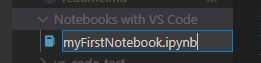
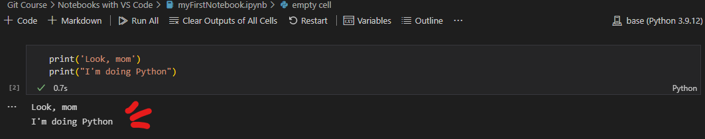

Go back to `readme.md`

# **How to Python**

Since I'll be using Jupyter Notebooks in order to run Python code, here you will find how to set up multiple editors in order to work with `.ipynb` 

* [Anaconda Navigator's](#anaconda) Notebook
* [Visual Studio Code](#vs-code) (which I recommend, because of its customization)

 

## **Anaconda Navigator's Notebook**

More on this one soon...

 

## ** Visual Studio Code **

For a better experience, install this extension:

 

1. Press `Ctrl + Shift + p` to open the command pallette and type **Python: Select Interpreter** in order to choose the installed interpreter for the Python code.

    
    

2. Create a new file in your working directory, with the extension `.ipynb`.

    

3. Select the Python kernel in the upper right corner.

    

4. Type some Python code in the default cell

    > Think of a cell as a code section that is executed isolatedly, but knows about variables that exist in the context (other cells).

    

5. Execute your code via the button at the left of the cell or press `Shift + Enter`

    
    

 

