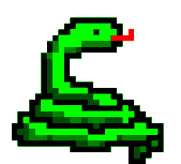

# **
 My Python learning trip 
**

In this repository I will be documenting my learning experience of the Python programming language. 
Alongside, I will be documenting the use of jupyter notebooks, a great tool that fuses the R, Julia and Python languages, and that is highly regarded by data scientists. 

    
Here, you'll find a list of the things I've learned:
 

* [How to work with Jupyter Notebooks files](editors/how_to_main)
* Python syntaxis
    * [Mathematical operators](basics/math_operators.md)
    * Logical operators
    * Declaring, intializing and referencing variables
    * Declaring, initializing and referencing data in the following data structures:
        * Lists
        * Dictionaries
        * Tuples
        * Sets
    * Navigation through data structures using
        * Loops
            * for
    * Conditional statements
* Common function usage
    * `print()`
        * Formatting text with regexs
    * Common data structure **CRUD** functions
        * `del()`
        * `pop()`
        * `insert()`
        * `append()`

 

For each topic, you will find a Jupyter Notebook file (`.ipynb`) where I put to practice my knowledge. 

I have programmed in Assembly x86, Java, C# and Javascript, and, so far, Python has one of the most comfortable syntaxes out there, and there is an amazing amount of videos out there that allow you to use the language for an innumerable amount of projects, so don't hesitate and learn it right now!  

I hope you find this information useful, wether you're a fellow programmer 💻, a recruiter 🛠 or someone ❔ curious ❔ about Python 🐍.   

### 
 This is the start of my journey. Good luck on yours! 

 

> This repository is part of the Github Introduction Workshop carried out in Instituto Tecnológico de
> Saltillo in October/November 2022.

 

## ¿What is Python?